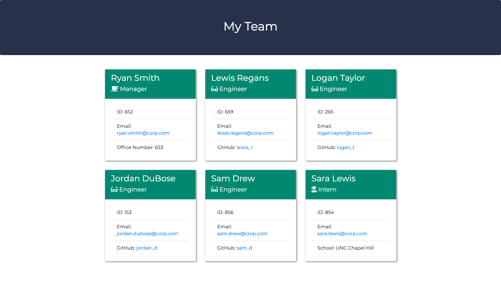

# Team Profile Generator

  [](https://opensource.org/licenses/ISC)

  ## Description
  This application was created to output a webpage displaying employee cards for a team based on user input about each member including email addresses, GitHub profiles, employee IDs, etc.

  ## Table of Contents

  * [Description](#description)
  * [Installation](#installation)
  * [Usage](#usage)
  * [Demo](#demo)
  * [License](#license)
  * [Contributing](#contributing)
  * [Tests](#tests)
  * [Questions](#questions)
  
  ## Installation

  To install necessary dependencies, please run the following command:
  ```
  npm i
  ```

  ## Usage
  This application requires node.js. Run the following to begin:
  ```
  node index.js
  ```
  
  You will then be prompted to answer some information on your team that will display on the webpage output located in the ./dist folder.

  

  ## Demo

  [Click here for a demo of the application.](https://drive.google.com/file/d/13KURF4GN3jHfd16LMpJbpxW6NzahdkEG/view?usp=sharing)

  ## License
  This project is covered under the ISC license. Visit the following link for more information on this license: [ISC](https://opensource.org/licenses/ISC)

  ## Tests
  To test, please run the following command:
  ```
  npm test
  ```

  ## Questions
  For any questions about the project, please contact me by either of the following links:
  
  * Email - jordan.dubose1@gmail.com 
  
  or visit my GitHub profile:
  
  * GitHub - [jordandub1](https://github.com/jordandub1)
